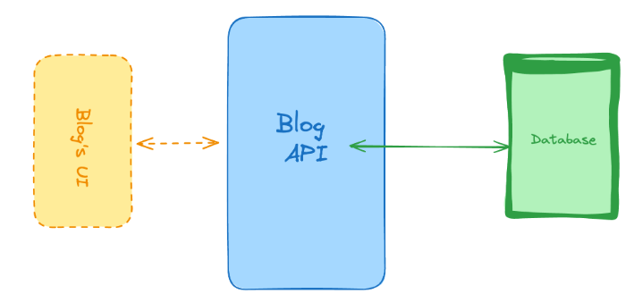

# Blog API

This Blog API is built with **NestJS** and **Prisma**, using **PostgreSQL** as the database provider. It provides basic CRUD functionality for managing blog articles and tags.

## Endpoints

### 1. Get All Articles

- **URL**: `/article`
- **Method**: `GET`
- **Query Params**:
  - `tags` (optional): A comma-separated list of tags to filter articles.
- **Description**: Fetches all articles. If the `tags` query is provided, it returns articles matching those tags.

### 2. Get One Article

- **URL**: `/article/:id`
- **Method**: `GET`
- **Route Params**:
  - `id`: The ID of the article to retrieve.
- **Description**: Fetches a single article by its ID.

### 3. Create an Article

- **URL**: `/article`
- **Method**: `POST`
- **Body**:

  ```json
  {
    "title": "string",
    "content": "string",
    "tags": ["tag1", "tag2"]
  }
  ```

  ### 4. Update Article

  - **URL**: `/article/:id`
  - **Method**: `PUT`
  - **Body**:

    ```json
    {
      "title": "string",
      "content": "string",
      "tags": ["tag1", "tag2"]
    }
    ```

    ### 5. Delete Article

    **URL**: `/article/:id`
    **Method**: `DELETE`

  ### Block Diagram


