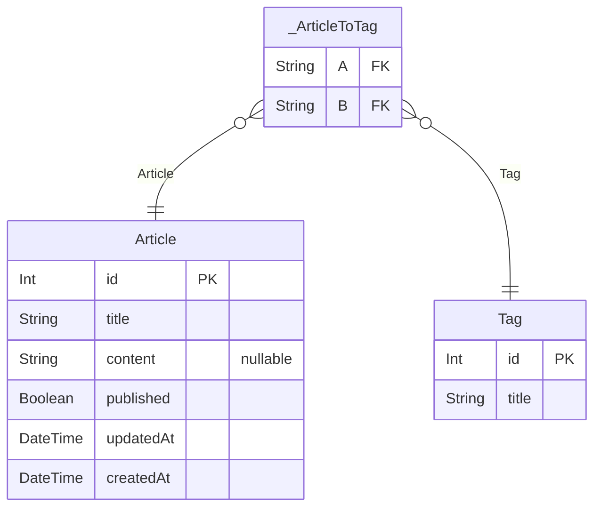

# PROJECT
> Generated by [`prisma-markdown`](https://github.com/samchon/prisma-markdown)

- [default](#default)

## default

### `Tag`

**Properties**
  - `id`: 
  - `title`: 

### `Article`

**Properties**
  - `id`: 
  - `title`: 
  - `content`: 
  - `published`: 
  - `updatedAt`: 
  - `createdAt`: 

### `_ArticleToTag`
Pair relationship table between [Article](#Article) and [Tag](#Tag)

**Properties**
  - `A`: 
  - `B`: 